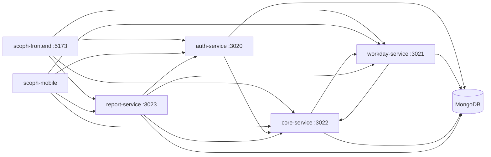

# SCOPH — Gestor de Jornadas Médicas

Software **privado** para que SCOPH planifique jornadas médicas, controle
inventario farmacéutico y genere reportes. El código fuente pertenece a
**Fundación Kinal** y se mantiene como parte del proceso formativo de
**Sexto Perito en Computación**, año con año.

No es un proyecto open source. Ver [LICENSE](./LICENSE) y
[COLABORACION.md](./COLABORACION.md).

## Qué resuelve

- Usuarios, roles y sesión (JWT).
- Jornadas médicas: alta, estados, médicos y acompañantes.
- Catálogo de medicamentos, inventario central y por jornada.
- Movimientos de entrada, salida, transferencia y retorno.
- Reportes, alertas de stock/vencimiento y exportación Excel/PDF.
- Cliente web (administración) y cliente móvil (campo).

## Titularidad y uso

| | |
| --- | --- |
| Titular del código | Fundación Kinal |
| Uso exclusivo | SCOPH, por el plazo pactado con Kinal |
| Mantenimiento | Promociones sucesivas de 6to Perito en Computación |
| Colaboración externa | No, salvo el proceso formativo de ese grado |

## Arquitectura

Cuatro APIs Node.js (Fastify) + MongoDB externo + web Vite + app Expo.
Los backends comparten el mismo `JWT_SECRET`. Mongo **no** está en
Docker Compose: corre en el host o en Atlas.



| Paquete | Rol | Puerto Compose | Prefijo HTTP | Health |
| --- | --- | --- | --- | --- |
| `auth-service` | Login, usuarios, correo, JWT | 3020 | `/api/auth` | `GET /api/healthz` |
| `workday-service` | Jornadas y estados | 3021 | `/api/v1` | `GET /api/v1/health` |
| `core-service` | Medicamentos, inventario, movimientos, auditoría | 3022 | `/api/v1` | `GET /api/v1/health` |
| `report-service` | Agrega datos y exporta reportes | 3023 | `/api/v1` | `GET /api/v1/health` |
| `scoph-frontend` | SPA React + Vite | 5173 (dev) | — | — |
| `scoph-mobile` | Expo / React Native | — | — | — |

Documentación interactiva de cada API: `http://localhost:<puerto>/api/docs`.

Si `PORT` no está definido, los defaults de código son otros (auth 8080,
core 3001, workday 3002, report 3003). En este proyecto **usa 3020–3023**.

## Stack

- Node 22, ESM, **pnpm** (no npm/yarn como gestor del repo).
- Fastify 5, Mongoose, `@fastify/jwt`, Swagger.
- React 19 + Vite 8 + Tailwind 4 + Zustand (web).
- Expo 55 + React Native 0.83 (móvil).
- Docker Compose solo para los cuatro backends (local).
- Render: un contenedor (`deploy/Dockerfile`) con SPA, nginx y las
  cuatro APIs. Correo: Resend. Mongo fuera.

## Documentación

| Documento | Para qué |
| --- | --- |
| [LICENSE](./LICENSE) | Titularidad y uso privado |
| [COLABORACION.md](./COLABORACION.md) / [CONTRIBUTING.md](./CONTRIBUTING.md) | Quién puede contribuir |
| [AGENTS.md](./AGENTS.md) | Manual para Cursor y otros agentes |
| [docs/ARQUITECTURA.md](./docs/ARQUITECTURA.md) | Servicios, datos y comunicación |
| [docs/ENTORNO-LOCAL.md](./docs/ENTORNO-LOCAL.md) | Cómo levantarlo en local (cuando toque) |
| [docs/SERVICIOS.md](./docs/SERVICIOS.md) | Rutas, env y scripts |
| [docs/ROLES-Y-PERMISOS.md](./docs/ROLES-Y-PERMISOS.md) | JWT y roles |
| [docs/SEGURIDAD.md](./docs/SEGURIDAD.md) | Secretos, datos y riesgos conocidos |
| [docs/GLOSARIO.md](./docs/GLOSARIO.md) | Términos de dominio |
| `.cursor/rules/` y `.cursor/skills/` | Reglas y skills versionadas para agentes |

## Requisitos (cuando se levante en local)

- Node.js 22 y [pnpm](https://pnpm.io) 10.x
- MongoDB accesible (local o Atlas)
- Docker y Docker Compose, si se usan los backends en contenedor
- Copia de `.env.example` → `.env` en la **raíz** (nunca subir secretos)

La guía paso a paso está en [docs/ENTORNO-LOCAL.md](./docs/ENTORNO-LOCAL.md).
**No hace falta levantarlo para leer o editar documentación.**

## Roles de producto

`SUPER_ADMIN` · `ADMIN` · `MEDICO`

`SUPER_ADMIN` bypasea `requireRole`. `MEDICO` entra a jornadas, no al
panel de inventario/usuarios/reportes. Detalle en
[docs/ROLES-Y-PERMISOS.md](./docs/ROLES-Y-PERMISOS.md).

## Pruebas

```bash
cd auth-service && pnpm test
cd ../workday-service && pnpm test
cd ../core-service && pnpm test
cd ../report-service && pnpm test
```

Frontend y móvil no tienen suite de tests en este repo.

## Aviso

Este repositorio y sus copias de trabajo son confidenciales respecto
del código y de cualquier dato operativo de SCOPH. No publiques forks.
